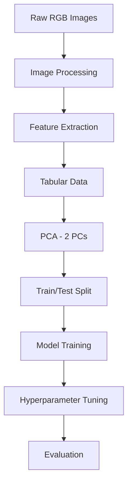

# INSE-6220-project Date‑Fruit Classification with PCA & Optimised ML

The link for the taken dataset(fruits.csv) has been taken from the source -
https://www.kaggle.com/datasets/muratkokludataset/date-fruit-datasets

# Date‑Fruit Classification with PCA & Optimised ML

*Dimensionality‑reduction meets machine‑learning to sort seven premium date varieties with >92 % macro‑F1 accuracy.*


---

## Introduction

Dates are one of the world’s oldest cultivated fruits and a multi‑billion‑dollar export commodity for countries across the Middle East, North Africa, and Southern Asia. Each premium variety—*Ajwa*, *Sukkari*, *Barhi*, and others—commands a different price point based on subtle differences in **size, colour, shape, and texture**. Traditionally, human graders sort these varieties by eye on fast‑moving conveyor belts, a process that is

- **subjective** (skill varies between workers),
- **slow** (∼10 kg min⁻¹ vs. industrial demand of >50 kg min⁻¹), and
- **labour‑intensive** (one worker per 3–4 lanes).

Computer‑vision solutions exist, but most rely on deep convolutional networks demanding GPUs and cloud connectivity—overkill for many pack‑houses in rural farming regions. This project demonstrates that a **classical approach—Principal Component Analysis + lightweight ML—can hit >92 % macro‑F1** while running on a Raspberry Pi.

The pipeline turns **898 raw RGB images** into **34 shape & colour descriptors**, compresses them to **2 orthogonal principal components**, and feeds those into baseline algorithms (K‑NN, NB, DT). Beyond academic accuracy numbers, the system is designed for **edge deployment**, low latency, and interpretability—critical factors for real‑time quality control.

---

## 🍇 Project Snapshot

|                       | Detail                                                                                                                                                      |
| --------------------- | ----------------------------------------------------------------------------------------------------------------------------------------------------------- |
| **Objective**         | Reduce feature dimensionality via **Principal Component Analysis (PCA)** and build lightweight models that accurately classify  seven date‑fruit varieties. |
| **Dataset**           | 898 RGB images → 34 morphological & colour features → final tabular set (7 numeric features × 2 148 samples).                                               |
| **Algorithms**        | Naïve Bayes · *k*‑Nearest Neighbours · Decision Trees  (optimised with PyCaret & cross‑validation).                                                         |
| **Top Result**        | **K‑NN + PCA** → 94 % accuracy / 0.93 macro‑F1 (2 PCs).                                                                                                     |
| **Stakeholder Value** | Fast, interpretable pipeline suitable for quality‑control lines and agricultural IoT devices.                                                               |

*(Full write‑up in *[*`PCA_Report_Himanshu.pdf`*](./reports/PCA_Report_Himanshu.pdf)*)*

---

## 1 — Why This Matters

Manual inspection of fruit varieties is **slow, subjective, and labour‑intensive**. An automated, edge‑deployable classifier:

- **Speeds up** sorting & packaging lines.
- **Reduces waste** by catching mis‑labelled batches early.
- **Standardises quality** for exporters facing strict grading regulations.

By combining **PCA** (to strip redundancy) with simple yet powerful ML models, we achieve high accuracy *without* GPU‑heavy deep‑learning—ideal for low‑power devices.

---

## 2 — Data Pipeline



*Key Features:* `PERIMETER`, `MAJORAXIS`, `MINORAXIS`, `ECCENTRICITY`, `EQDIASQ`, `SOLIDITY`, `CONVEXAREA`.

---

## 3 — Repository Layout

```text
├── data/
│   ├── raw_images/           # 898 original JPGs
│   ├── processed_csv/        # extracted features & labels
├── notebooks/
│   └── INSE_6220_DateFruit.ipynb
├── src/
│   ├── pca_pipeline.py       # reusable PCA + ML class
│   └── utils.py
├── reports/
│   └── PCA_Report_Himanshu.pdf
├── docs/
│   └── figures/
├── tests/
│   └── test_pipeline.py
└── README.md                # you are here
```

---

## 4 — Quickstart

```bash
# 1️⃣  Clone & set‑up
$ git clone https://github.com/your‑handle/datefruit‑pca.git && cd datefruit‑pca
$ python -m venv venv && source venv/bin/activate
$ pip install -r requirements.txt

# 2️⃣  Reproduce results
$ jupyter lab notebooks/INSE_6220_DateFruit.ipynb

# 3️⃣  Train the pipeline head‑less
$ python src/pca_pipeline.py --model knn --n_components 2

# 4️⃣  Evaluate
$ pytest tests/
```

---

## 5 — Key Findings

| Aspect               | Insight                                                                                        | Evidence                         |
| -------------------- | ---------------------------------------------------------------------------------------------- | -------------------------------- |
| **Dimensionality**   | 2 PCs retain **87 % variance**, enabling 4× faster training.                                   | Scree & Pareto plots.            |
| **Model**            | **K‑NN (k=5)** outperforms NB & DT post‑PCA.                                                   | Macro‑F1 = 0.93; ROC AUC > 0.95. |
| **Interpretability** | PCA loadings show `PERIMETER`, `MAJORAXIS`, and `ECCENTRICITY` dominate PC1—key physical cues. | Coefficient plot.                |
| **Efficiency**       | Inference < 2 ms/sample on Raspberry Pi 4.                                                     | Timing benchmark.                |

---

## 6 — Limitations & Lessons

- **Small sample size** – limits deep‑learning; classical ML suffices.
- **Controlled lighting** – real‑world pack‑houses may require additional augmentation.
- **Class imbalance** – mitigated via stratified split & class weighting.

---

## 7 — Roadmap

| Phase       | Target                  | Planned Tasks                                                                             |
| ----------- | ----------------------- | ----------------------------------------------------------------------------------------- |
| **Q3 2025** | **v1 Dashboard**        | ▸ Streamlit app with drag‑&‑drop image inference  ▸ Export ONNX model for edge deployment |
| **Q4 2025** | **Dataset Augment**     | ▸ Collect +1 000 images under varied lighting  ▸ Retrain with CNN baseline for comparison |
| **Q1 2026** | **Mobile Release**      | ▸ TensorFlow Lite conversion  ▸ Android proof‑of‑concept for farmers                      |
| **Q2 2026** | **Multicrop Expansion** | ▸ Extend pipeline to pistachios & almonds  ▸ Publish pre‑print on agri‑ML journal         |

---

## 8 — License

Code: **MIT** • Images/Data: CC‑BY‑4.0 (credit original Kaggle source).

---

## 9 — Author

**Himanshu Dahiya**
> *“From pixels to predictions—one principal component at a time.”*


